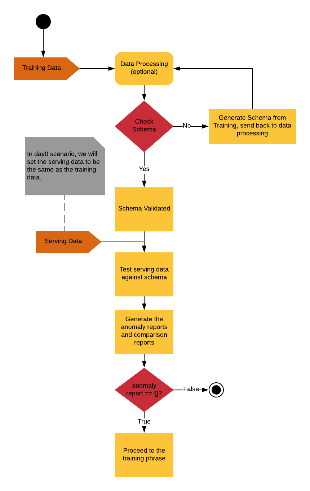

***********
Data Tests
***********

Schema-based Data Validation
============================

What to test?
-------------
The schema based validation tests are designed to encapsulate the intuition of the data in a schema automatically. 
Once the schema is setup, it is used as a baseline data model to test training  and serving data to prevent potential data drift / concept drift. 

How to test?
------------

The schema should at least capture the following information:
The schema should at least capture the following information:

- descriptive statistics
- correlation coefficient to check feature dependency
- data characteristics (types, range) 

To perform schema-based validation, the basic logic for this tests would be only if the incoming training / serving data pass the test, we then will continue to pass the data to model training or making inference. 
The process of generating the schema creation should be agnostic, which is portable to another platforms, either in local or in cloud.

   Schema-based data validation workflow

Rule-based Feature Governance
=============================

What to test?
-------------

Rule-based feature governance is the additional consideration when performing schema-based data validation. Data Scientist / Data Engineer would curate their automatically generated schema before using it as baseline.

How to test?
------------

The considerations when curated the schema would covers:

Are these features adds value to the prediction? Maintaining unnecessary costs computing wise so we want to make sure the features we are added adds enough value to the prediction outcomes.
Are these features adhere to the meta-level requirements? Do we need to prohibit sensitive data? Do we need to trim or mask feature to improve performance or meets privacy standards?
These new curated schema should be reflective of these considerations by imposing the restrictions in the schema.

Feature and Transformation Testing
==================================

What to test?
-------------

Data transformation is a routine process before model training. Yet the feature transformations are usually coded and not as immutable as a data schema. So the purpose of this test is to ensure the input feature code met our expectations and it won't cause trouble in the later phrase of the model development.

How to test?
------------

To perform such test, we will illustrate the idea using a simple example:

.. Note:: Suppose we have a transformation code T, where T(x) = xˆ2. A data scientist want to construct a unit test on this particular transformation code. The simplest approach is to take a small sample of the data and smoke test to see if the output of the tests equals to the expected outcomes. In this example, the data scientists take three values, 2, 3, and 4 and to see if T(2) = 4, T(3) = 9 and T(4) = 16. The example here may sounds simple and unnecessary. However, if there were any bugs in the data transformation phrase, it would be hard to detect it in the future once we are using it in data generation for both training and testing. Therefore, it is crucial to test all input feature codes when constructing ML testing framework.

